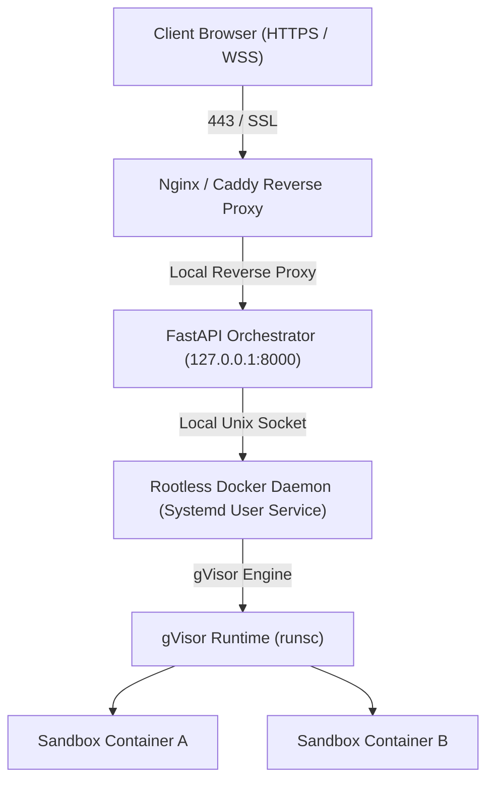

# Production Deployment & Security Hardening Guide

This document outlines the architecture, setup requirements, and security best practices for deploying the terminal-based quiz platform in a production environment.

---

## 1. Architecture Overview



---

## 2. Infrastructure Setup & Requirements

### A. Kernel & CPU Acceleration (KVM)
To achieve low latency and minimal virtualization overhead inside the gVisor sandboxes:
1. Ensure the host CPU supports virtualization (VT-x / AMD-V) and that `/dev/kvm` is present on the host.
2. Grant the user running the orchestrator access to `/dev/kvm`:
   ```bash
   sudo usermod -aG kvm <username>
   ```

### B. Rootless Docker Service Setup
Rootless Docker ensures that if a container escape occurs, the attacker only gains user-level privileges on the host machine.
1. Install rootless docker by following the [official guide](https://docs.docker.com/engine/security/rootless/).
2. Enable user service persistence so Docker remains active even if you log out:
   ```bash
   sudo loginctl enable-linger <username>
   ```
3. **Configure and Enforce ICC Isolation (Inter-Container Communication)**:
   By setting `DOCKER_IGNORE_BR_NETFILTER_ERROR=1`, Docker only bypasses the startup error check, but **does not actually enforce isolation** (containers can still talk to each other because the host bridge filter is missing).
   
   To make ICC isolation actually work:
   - Load the `br_netfilter` module on the host kernel:
     ```bash
     sudo modprobe br_netfilter
     echo "br_netfilter" | sudo tee -a /etc/modules
     ```
   - Verify that `/proc/sys/net/bridge/bridge-nf-call-iptables` now exists and contains `1`.
   - Once the module is loaded, rootless Docker will natively enforce the `enable_icc=false` isolation rule without requiring any ignore variables or warnings.

### C. gVisor (runsc) Integration
1. Install `runsc` on the host.
2. Register the runtime in your rootless daemon configuration (`~/.config/docker/daemon.json`):
   ```json
   {
     "runtimes": {
       "runsc": {
         "path": "/usr/bin/runsc",
         "runtimeArgs": [
           "--ignore-cgroups"
         ]
       }
     }
   }
   ```
3. Restart the user docker service:
   ```bash
   systemctl --user restart docker
   ```

---

## 3. Reverse Proxy & WebSocket Configuration

Do not expose the FastAPI backend directly to the internet. Always deploy behind a reverse proxy (e.g., Nginx or Caddy) to handle SSL/TLS termination and WebSocket upgrading.

### Nginx Configuration Example
Create a config file (e.g., `/etc/nginx/sites-available/quiz.conf`):

```nginx
server {
    listen 80;
    server_name quiz.yourdomain.com;
    return 301 https://$host$request_uri; # Redirect HTTP to HTTPS
}

server {
    listen 443 ssl http2;
    server_name quiz.yourdomain.com;

    ssl_certificate /etc/letsencrypt/live/quiz.yourdomain.com/fullchain.pem;
    ssl_certificate_key /etc/letsencrypt/live/quiz.yourdomain.com/privkey.pem;

    # Secure SSL parameters
    ssl_protocols TLSv1.2 TLSv1.3;
    ssl_prefer_server_ciphers on;

    # Frontend and Standard API endpoints
    location / {
        proxy_pass http://127.0.0.1:8000;
        proxy_set_header Host $host;
        proxy_set_header X-Real-IP $remote_addr;
        proxy_set_header X-Forwarded-For $proxy_add_x_forwarded_for;
        proxy_set_header X-Forwarded-Proto $scheme;
    }

    # WebSocket Proxying (Crucial for Terminal WebSocket)
    location /ws/ {
        proxy_pass http://127.0.0.1:8000;
        proxy_http_version 1.1;
        proxy_set_header Upgrade $http_upgrade;
        proxy_set_header Connection "upgrade";
        proxy_set_header Host $host;
        proxy_set_header X-Real-IP $remote_addr;
        proxy_set_header X-Forwarded-For $proxy_add_x_forwarded_for;
        proxy_read_timeout 86400s; # Prevent timeout disconnects
        proxy_send_timeout 86400s;
    }
}
```

---

## 4. Application Hardening Checklists

### A. FastAPI Orchestrator Security
1. **Disable Wildcard CORS**: Update CORS middleware in [main.py](file:///home/sandbox-noadmin/PycharmProjects/sentences-user-survey-platform/main.py#L17) to restrict origins to your frontend domain:
   ```python
   app.add_middleware(
       CORSMiddleware,
       allow_origins=["https://quiz.yourdomain.com"],
       allow_credentials=True,
       allow_methods=["GET", "POST"],
       allow_headers=["*"],
   )
   ```
2. **Rate Limiting (DoS Mitigation)**: Install `slowapi` and enforce limits on `/api/start-session` (e.g., 5 starts per minute per IP).
3. **Disable Stale Sessions API**: Ensure `/api/sessions` is either completely disabled or restricted behind admin authentication.
4. **Session Token Validation**: Secure WebSocket connections by requiring a short-lived cryptographically signed token (JWT) instead of relying solely on UUID routing.

### B. Sandbox Resource Constraints
Ensure your [config.py](file:///home/sandbox-noadmin/PycharmProjects/sentences-user-survey-platform/config.py) limits match host capacity.
* Limit memory limits (`CONTAINER_MEM_LIMIT=256m`) and CPU cores (`CONTAINER_CPU_LIMIT=0.5`).
* Enforce storage constraints to prevent disk-fill attacks. Pass a `storage_opt` limit (e.g., `"size": "1G"`) if using `overlay2` storage driver:
  ```python
  storage_opt={"size": "500m"}
  ```

---

## 5. Systemd Production Service Setup

Run the FastAPI orchestrator as a systemd user-level service to ensure it recovers from crashes.

1. Create a service file `~/.config/systemd/user/quiz-orchestrator.service`:
   ```ini
   [Unit]
   Description=Quiz Terminal Orchestrator FastAPI Daemon
   After=network.target

   [Service]
   WorkingDirectory=/home/sandbox-noadmin/PycharmProjects/sentences-user-survey-platform
   Environment="DOCKER_HOST=unix:///run/user/1001/docker.sock"
   Environment="PATH=/home/sandbox-noadmin/PycharmProjects/sentences-user-survey-platform/.venv/bin:/usr/local/bin:/usr/bin:/bin"
   ExecStart=/home/sandbox-noadmin/PycharmProjects/sentences-user-survey-platform/.venv/bin/uvicorn main:app --host 127.0.0.1 --port 8000
   Restart=always
   RestartSec=5

   [Install]
   WantedBy=default.target
   ```
2. Enable and start the service:
   ```bash
   systemctl --user daemon-reload
   systemctl --user enable quiz-orchestrator
   systemctl --user start quiz-orchestrator
   ```
3. Check the status:
   ```bash
   systemctl --user status quiz-orchestrator
   ```
